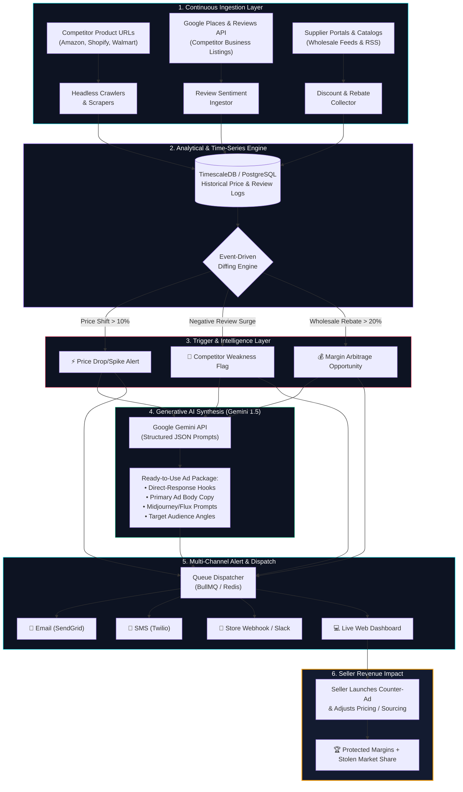

# MarketPulse AI — Automated Market Intelligence & Counter-Campaign SaaS

[](https://nodejs.org/)
[](LICENSE)
[](https://ai.google.dev/)
[](#)
[](https://bengalbound.github.io/market-pulse/)

> 🌐 **Live Interactive Prototype & Pitch Deck**: [https://bengalbound.github.io/market-pulse/](https://bengalbound.github.io/market-pulse/)  
> *(Test the live pulse radar, interactive 30-day SVG charts, Gemini AI counter-campaign generator, and 10-slide investor deck directly in your browser without local setup!)*

MarketPulse AI is an automated market research, price monitoring, and counter-campaign generation platform built for modern e-commerce sellers (Shopify, Amazon FBA, DTC). 

It continuously monitors competitor price shifts, supplier wholesale discounts, and competitor customer reviews, and automatically translates those signals into actionable direct-response advertising campaigns (Meta, Google, TikTok) via LLMs.

---

## ⚡ Core Value Pillars

1. **Competitor Pricing Radar**: Time-series tracking of competitor price cuts and spikes with customizable alert thresholds (>10%, >15%, >20%).
2. **Supplier Discount & Wholesale Arbitrage**: Monitoring wholesale component catalogs to alert sellers to bulk discount opportunities that expand gross margins by 15%–35%.
3. **Competitor Review Sentiment & Weakness Radar**: Automated ingestion of Google and Amazon customer reviews to pinpoint recurring complaints (e.g. "slow shipping", "broken hinge", "robotic support").
4. **AI Counter-Campaign Generator**: Direct-response marketing engine powered by Google Gemini API that automatically drafts ad hooks, primary copy, and Midjourney/Flux creative prompts capitalizing on competitor flaws.
5. **Interactive 10-Slide Investor Pitch Deck**: Built-in full-screen presentation mode (`/ #pitch` or press `P`) with presenter talking-point notes (`N`) covering unit economics, 50/50 partnership alignment, and a 90-day GTM roadmap.

---

## 🔄 End-to-End System Workflow



### 📋 Detailed Operational Lifecycle

1. **Ingest**: Distributed scrapers extract competitor prices, customer review texts, and supplier catalog pricing on a configured schedule (Hourly/Daily).
2. **Diff & Detect**: Incoming price logs are compared with historical baselines in TimescaleDB. If a price drops by more than the user threshold (e.g. `>15%`) or reviews report recurring product defects (e.g. *"broken switches"*, *"ghost support"*), an anomaly trigger fires.
3. **Synthesize (AI Counter-Campaign)**: The anomaly trigger, competitor name, and customer complaints are passed into Google Gemini 1.5 Flash with structured prompt templates.
4. **Generate**: The engine outputs direct-response ad copy, high-converting hooks, headlines, CTAs, and Midjourney image prompts designed to win over frustrated competitor buyers.
5. **Dispatch**: Alert payloads with generated counter-campaigns are immediately delivered across Email (SendGrid), SMS (Twilio), and Webhooks.
6. **Action**: The seller reviews the notification, clicks *"Copy Campaign"* or connects directly to Meta/Google Ads, turning competitor disruptions into profitable customer acquisition.

---

## 🏗️ Architecture & Tech Stack

```
                          ┌──────────────────────────────────────┐
                          │    Single-Page Web Application       │
                          │   (Vanilla JS, Custom SVG Charts)    │
                          └──────────────────┬───────────────────┘
                                             │
                                             ▼
                          ┌──────────────────────────────────────┐
                          │         Node.js Express REST API     │
                          └──────┬───────────┬───────────┬───────┘
                                 │           │           │
                                 ▼           ▼           ▼
                      ┌────────────────┐ ┌───────────┐ ┌───────────────┐
                      │ Diffing Engine │ │ AI Engine │ │ Alert Engine  │
                      │ Price/Margins  │ │ Gemini /  │ │ Email, SMS &  │
                      │ & Thresholds   │ │ Heuristic │ │ Webhook Push  │
                      └────────────────┘ └───────────┘ └───────────────┘
```

- **Backend**: Node.js, Express.js, CORS, Dotenv
- **AI Integration**: `@google/generative-ai` (Gemini 1.5 Flash) with zero-latency intelligent fallback
- **Frontend**: Responsive Single-Page Application, custom dark-mode cyber glassmorphism, zero-dependency interactive SVG time-series charts
- **Production Database Blueprint**: Prisma schema for PostgreSQL & TimescaleDB hypertables (`src/docs/schema.prisma`)

---

## 🚀 Quick Start

### 1. Installation
```bash
git clone https://github.com/BengalBound/market-pulse.git
cd market-pulse
npm install
```

### 2. Configure Environment (Optional)
```bash
cp .env.example .env
```
*(Optional: Add your `GEMINI_API_KEY` for live Google Gemini generation. If left empty, the built-in smart contextual heuristic engine generates high-converting assets instantly.)*

### 3. Launch Platform
```bash
npm start
```
Open **[http://localhost:3000](http://localhost:3000)** in your browser.

- **Investor Pitch Mode**: Press `P` or visit `http://localhost:3000/#pitch`
- **Toggle Presenter Notes**: Press `N` during pitch mode

---

## 📡 REST API Reference

| Endpoint | Method | Description |
| :--- | :--- | :--- |
| `/api/health` | `GET` | Health check & active AI mode indicator |
| `/api/pulse` | `GET` | Aggregated market shifts, active alert counts, ticker feed |
| `/api/competitors/pricing` | `GET` | 30-day historical price curves & threshold triggers |
| `/api/reviews/tracker` | `GET` | Google reviews, sentiment score, extracted pain points |
| `/api/suppliers/discounts` | `GET` | Wholesale discount catalog & margin expansion metrics |
| `/api/ai/generate-ad` | `POST` | Live / Contextual direct-response ad copy generation |
| `/api/alerts/dispatch` | `POST` | Multi-channel alert delivery test (Email, SMS, Webhook) |
| `/api/subscriptions/tiers` | `GET` | SaaS tier pricing ($49 Starter, $199 Pro, $499 Enterprise) |

---

## 💼 Business Model & Unit Economics

- **Starter Seller**: $49/mo (Up to 10 products, daily scans, 30 AI prompts)
- **Growth Merchant (Core)**: $199/mo (Up to 100 products, hourly scans, unlimited AI counter-campaigns, SMS alerts)
- **Enterprise Brand**: $499/mo (Unlimited tracking, residential proxy crawlers, API access, multi-brand workspaces)

---

## 📄 License
MIT License. Built for scaling e-commerce brands.
